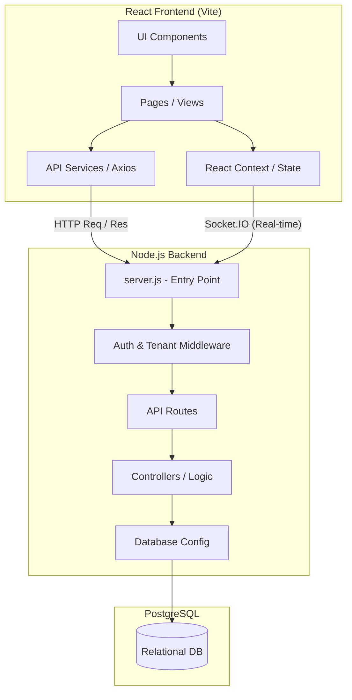
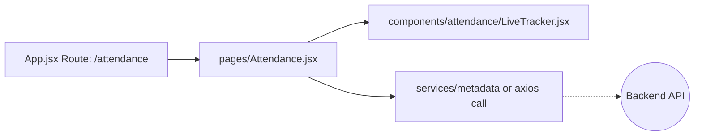
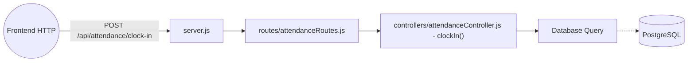

# HRMS Architecture & Structural Flow

This document maps out the full structural flow of your codebase. It shows how the different modules (like Attendance, Employees, Payroll) are connected between the frontend and the backend, making it easier to know **which file to modify** when you need to make changes in the future.

## 🏗️ High-Level System Architecture

The application is built using a modern React frontend (Vite) and a Node.js/Express backend (PostgreSQL) with a real-time Socket.IO layer.

---

## 📂 Frontend Directory Structure

The frontend is located in `frontend/src/` and follows a component-page-service architecture.

| Directory / File | Description & Responsibility | When to change this? |
| :--- | :--- | :--- |
| **`App.jsx`** | Central Router connecting URLs to Pages (e.g., `/attendance` ➔ `Attendance.jsx`). | When adding a new page or new route. |
| **`pages/`** | Contains the top-level views for each module (e.g., `Attendance.jsx`, `Employees.jsx`). | When altering the main layout or data fetching for a feature. |
| **`components/`** | Reusable UI pieces (e.g., Tables, Modals) sorted by module (e.g., `attendance/`, `dashboard/`). | When fixing a UI bug or styling a specific visual element on a page. |
| **`context/`** | Global state managers (`AuthContext.jsx`, `SocketContext.jsx`). | When modifying user login state, socket connections, or notifications. |
| **`services/`** | API request wrappers (using Axios) that talk to the backend. | When an API endpoint URL changes or you need to send new data to the backend. |
| **`styles/`** | Global CSS (`global.css`) and specific module CSS (e.g., `Dashboard.css`). | When modifying the global theme, colors, or base styling. |

### Frontend Module Flow Example (Attendance)

---

## ⚙️ Backend Directory Structure

The backend is located in `backend/src/` and follows a standard MVC (Model-View-Controller) pattern.

| Directory / File | Description & Responsibility | When to change this? |
| :--- | :--- | :--- |
| **`server.js`** | Main entry point. Defines base URL paths (e.g., `app.use('/api/attendance', attendanceRoutes);`) and Socket.IO configuration. | When adding a brand new module or changing global middleware (like CORS or Rate Limits). |
| **`routes/`** | Maps specific endpoint URLs to Controller functions (e.g., `GET /`, `POST /clock-in`). | When you need a new API endpoint. |
| **`controllers/`** | Contains the actual business logic, processes requests, and talks to the database. | When changing *how* a feature works (e.g., altering how overtime is calculated). |
| **`middleware/`** | Security and multi-tenancy layers (e.g., `tenantMiddleware.js`, `errorHandler.js`). | When shifting tenant logic, authentication rules, or error responses. |
| **`config/`** | Setup for the Database (`database.js`) and database schemas (`shared_schema.sql`). | When updating the DB connection string or pooling rules. |
| **`scripts/`** | Utility logic for initial setups or migrations (e.g., `add_shift_tables.js`). | When making schema changes via migrations. |

### Backend Module Flow Example (Attendance)

---

## 🔗 Feature Mapping Cheat Sheet

If you want to edit a specific feature, look at this map to find the exact files you need to touch:

### 1. Authentication & Users
* **Frontend:** `pages/Login.jsx`, `context/AuthContext.jsx`
* **Backend:** `routes/authRoutes.js`, `controllers/authController.js`
* **Middleware:** `middleware/validate.js`, JWT checks in routes.

### 2. Employee Management
* **Frontend:** `pages/Employees.jsx`, `pages/Profile.jsx`, `components/employees/`
* **Backend:** `routes/employeeRoutes.js`, `routes/departmentRoutes.js`

### 3. Attendance, Shifts & Geo-fencing
* **Frontend:** `pages/Attendance.jsx`, `components/attendance/`
* **Backend:** `routes/attendanceRoutes.js`, `routes/shiftRoutes.js` 

### 4. Chat & Real-Time Communications (WebSockets)
* **Frontend:** `pages/Chat.jsx`, `components/chat/`, `context/SocketContext.jsx`
* **Backend:** `routes/chatRoutes.js`, **`server.js (Socket.IO block)`**

### 5. Payroll
* **Frontend:** `pages/Payroll.jsx`, `pages/MyPayslips.jsx`, `components/payroll/`
* **Backend:** `routes/payrollRoutes.js`

> [!TIP]
> **To add a new feature (e.g., "Expenses"):**
> 1. Start in Backend: Create `backend/src/routes/expenseRoutes.js`.
> 2. Link it in `backend/src/server.js` (`app.use('/api/expenses', expenseRoutes);`).
> 3. Write logic in `backend/src/controllers/expenseController.js`.
> 4. Go to Frontend: Create `frontend/src/pages/Expenses.jsx`.
> 5. Add route in `frontend/src/App.jsx`.
> 6. Create UI components in `frontend/src/components/expenses/`.
